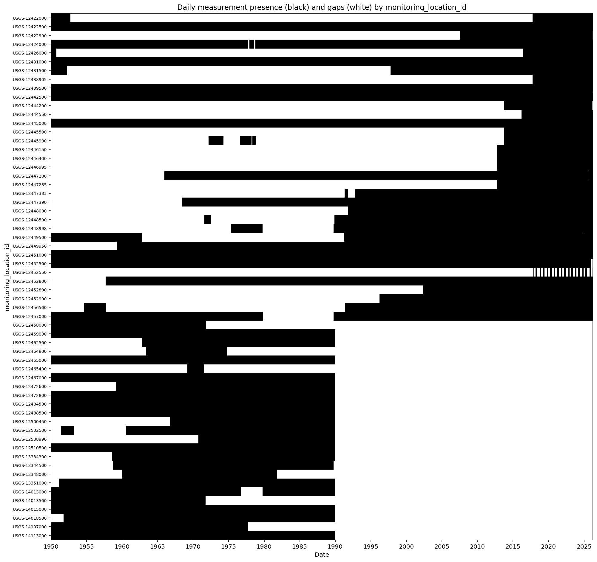

# ML model selection and justification

ARIMA 

 Given our limited dataset of flow rates across 50 surface water monitoring locations, a Seasonal ARIMA model provides a robust and interpretable forecasting framework that can extract meaningful seasonal patterns and autoregressive trends from univariate flow records without demanding the large training volumes that more complex architectures require. Its transparent structure and well-defined confidence intervals are particularly valuable when our scope of inference is confined to surface water level interpretations, ensuring that stakeholders and regulators can clearly understand and trust the basis of each site-level forecast. 

# Data dictionary table

Cleaned and engineered dataset is in `Data/data_cleaned.csv`. The data covers
50 monitoring locations from January 1, 2000 to March 30, 2026. The columns
in the data are as follows:

| Field Name | Description | Data Type | Example |
|---|---|---|---|
| monitoring_location_id | The USGS id for the monitoring location. | string | USGS-12422500 |
| time | The date that the measurement was taken. | Pandas timestamp | 2000-12-25 00:00:00+00:00 |
| flow_rate | The average flow rate at the location on the given date. | float | 2230.0 |
| qualifier | Qualifiers regarding data quality. See data preparation paragraph for details on qualifiers and which were omitted. | string | \['ESTIMATED', 'REVISED'\] |
| latitude | Latitude of the monitoring location. | float | 47.6593354474072 |
| longitude | Longitude of the monitoring location. | float | -117.449102931018 |
| seasonal_sin | Sine embedding of day of the year, to capture seasonality while avoiding discontinuities at calendar year boundaries. | float | -0.11988093 |
| seasonal_cos | Cosine embedding of day of the year, to capture seasonality while avoiding discontinuities at calendar year boundaries. | float | 0.99278826 |
| trend | A simple linear trend from January 1, 2000 to March 30, 2026; does not depend on the values in the table. The model can weight and incorporate this to account for long-term general trends. | float | 0.98288846 |
| rolling_7 | Rolling average of flow_rate over previous 7 days. | float | 2257.1428571428600 |
| rolling_14 | Rolling average of flow_rate over previous 14 days. | float | 2260.0 |
| rolling_21 | Rolling average of flow_rate over previous 21 days. | float | 2159.0476190476200 |

# Data preparation paragraph

Our data preparation began with an AI-assisted completeness assessment, in which we used ChatGPT to generate a gap plot visualizing daily measurement coverage across all 61 surface water monitoring locations (Figure 1). Early in the process, we decided to pivot from subsurface water-level data to surface water flow rates due to incomplete geologic metadata. Specifically, even where depth-to-water measurements existed for individual wells, the dataset lacked reliable aquifer or formation identifiers, making it impossible to compare water levels across wells on an apples-to-apples basis. Surface water flow rates, by contrast, offered a physically consistent and directly comparable measurement across all sites. The gap plot diagnostic revealed substantial data sparsity prior to 2000 and guided two key cleaning decisions: truncating all records to the post-2000 period and retaining only sites with at least 80% daily coverage within that window. ChatGPT was used throughout to draft and refine the Python code for filtering, duplicate resolution, and short-gap interpolation. Feature engineering, currently in progress, includes cyclical sine/cosine encodings of day-of-year to capture seasonal flow patterns, lag and rolling-window statistics to represent antecedent conditions, and STL trend-seasonality decomposition to isolate long-term trajectories and recurring signals for input into our forecasting model.

Figure 1. Lag analysis completed in ChatGPT on unclean dataset to better inform data clean up efforts. Black indicates continuous daily measurements and white space indicates gaps in measurements.

Our data gathering and preparation scripts are located in the `Scripts` folder. To run the first two scripts, you will need a USGS water data API key, which can be obtained at https://api.waterdata.usgs.gov/signup/. This will need to be set as an environment variable, for example by running `export API_USGS_PAT=[your key]` in terminal. The third and fourth script (exploration and cleaning) should run out of the box, using the data that is present in the `Data` folder.
