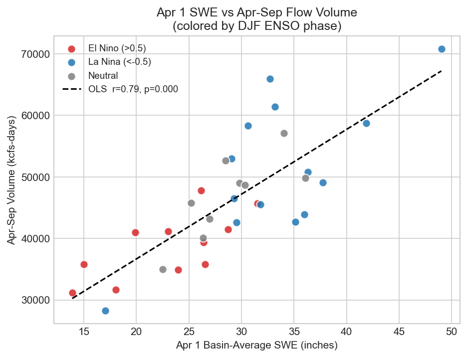
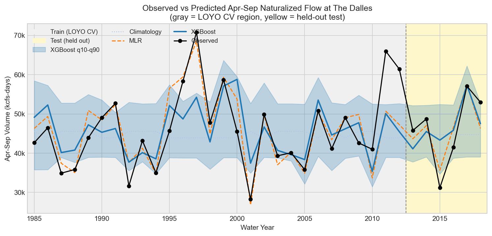
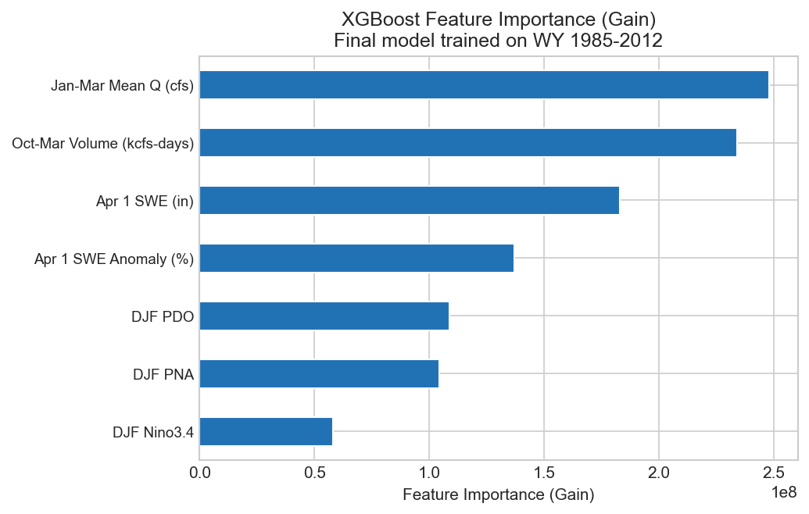
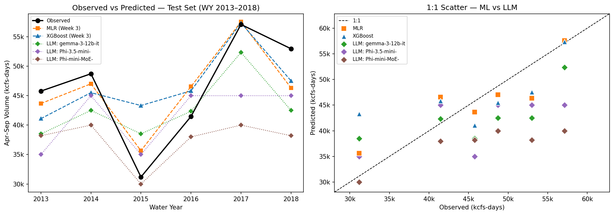

## The Problem {.center}

**Predict April–September naturalized streamflow volume at The Dalles, OR**

:::: {.columns}

::: {.column width="50%"}
**Why it matters**

- Snowmelt-driven Columbia Basin supplies hydropower, agriculture, and municipal water for the Pacific Northwest
- Forecasts issued each April 1 inform reservoir operations for the coming summer
- Existing NRCS/NWRFC forecasts use statistical methods — can ML improve on them?
:::

::: {.column width="50%"}
**Success criteria**

| Metric | Target |
|---|---|
| NSE | > 0 (beat mean) |
| RMSE | < 8,488 kcfs-days (beat climatology) |
| Skill score | > 0 vs climatology |

**Target variable:** Apr–Sep naturalized flow volume (kcfs-days)
**Forecast window:** Conditions known by April 1
:::

::::

::: {.notes}
Stefan or Cameron — set the scene. The Dalles is the most important control point on the Columbia River. Naturalized flow removes reservoir regulation effects so we're modeling the basin's actual water supply, not what operators decided to release. Our success bar was simply: beat the climatology (historical average) on the held-out test set.
:::

---

## Data & Key Predictors

:::: {.columns}

::: {.column width="48%"}
**Four data sources → 7 features**

| Feature | Source | r |
|---|---|---|
| Apr 1 SWE anomaly (%) | NRCS SNOTEL (16 stations) | **0.79** |
| Jan–Mar mean flow (cfs) | BPA natural flow | 0.56 |
| Oct–Mar volume (kcfs-days) | BPA natural flow | 0.55 |
| DJF Nino3.4 | NOAA PSL | −0.46 |
| DJF PDO | NOAA PSL | −0.45 |
| DJF PNA | NOAA PSL | −0.40 |

34 complete water years (WY 1985–2018)
:::

::: {.column width="52%"}

:::

::::

::: {.notes}
Amanda or Jana — highlight that we used naturalized (BPA modified) flow, not observed regulated flow. The scatter plot shows the two key signals: snowpack (r = 0.79) and ENSO phase. La Niña winters enhance Pacific Northwest precipitation; El Niño suppresses it — the vertical spread at any SWE value reflects that teleconnection. This guided our feature engineering choices.
:::

---

## Methodology

```{mermaid}
flowchart LR
  A[Raw Data\n4 sources] --> B[Clean & QA/QC\n02_clean_data.py]
  B --> C[Feature Engineering\n03_feature_engineering.py]
  C --> D{Temporal Split}
  D -->|WY 1985–2012\n28 years| E[Train/Val\nLOYO CV]
  D -->|WY 2013–2018\n6 years| F[Test\nheld out]
  E --> G[Tune XGBoost\noptuna 50 trials]
  E --> H[Fit MLR\nStandardScaler]
  G --> I[Evaluate\non test set]
  H --> I
```

**Leakage prevention:** Temporal split only — no future data used in training. Hyperparameter tuning done inside LOYO folds on training years only. Test set locked until final evaluation.

::: {.notes}
Matt — walk through the pipeline. The key design decision is the temporal split: we held out the 6 most recent years (2013–2018) as a true holdout. Leave-One-Year-Out cross-validation within the training set tuned XGBoost hyperparameters without ever seeing the test years. This mirrors how operational forecasts work — you never have future data.
:::

---

## ML Results

:::: {.columns}

::: {.column width="55%"}

:::

::: {.column width="45%"}
**Test set performance (WY 2013–2018)**

| Model | NSE | RMSE |
|---|---|---|
| Climatology | −0.03 | 8,488 |
| **MLR** | **0.77** | **4,034** |
| XGBoost | 0.46 | 6,170 |

**MLR outperforms XGBoost** — expected with n=34. Linear relationships dominate at this sample size; XGBoost's nonlinear capacity is a liability without more data.

LOYO CV NSE: MLR = 0.69, XGBoost = 0.44 — consistent with test set, no overfitting signal.
:::

::::

::: {.notes}
Cameron — the headline finding is that the simple linear model won. This is physically reasonable: Apr 1 SWE is linearly correlated with spring runoff (r = 0.79). XGBoost would likely outperform MLR with a longer training record. The prediction intervals from XGBoost quantile regression have ~67% coverage vs the 80% target — the model is somewhat overconfident.
:::

---

## Interpretability

:::: {.columns}

::: {.column width="52%"}

:::

::: {.column width="48%"}
**What the model learned**

- **Antecedent flow** (Jan–Mar, Oct–Mar) ranked highest — captures early snowmelt and baseflow that SWE alone misses
- **Apr 1 SWE** still central — both raw inches and anomaly % appear, reflecting scale and departure from median
- **Climate indices** (PDO, PNA, Nino3.4) provide secondary modulation — the ENSO scatter plot pattern is reflected here

**Physical check:** Rankings align with operational forecaster intuition. No spurious features.
:::

::::

::: {.notes}
Stefan — the feature importance is physically interpretable, which is a good sign. Operational NRCS forecasters weight snowpack heavily but also use antecedent flow as a quality check on snowpack accumulation. The fact that Jan–Mar flow tops the list makes sense: by Jan–Mar you have more current information than the Oct–Mar integral.
:::

---

## LLM Benchmarking Approach

**Can a general-purpose LLM predict streamflow volume from a text description of predictors?**

:::: {.columns}

::: {.column width="55%"}
**Prompt design**

```
You are a hydrologist forecasting seasonal water supply.
Given conditions for a water year, predict the total
April–September naturalized streamflow volume.

Rules:
- Return ONLY: {"prediction_kcfs_days": <number>}
- Typical range: 28,000–71,000 kcfs-days

Water year 2013 conditions:
- Apr 1 SWE: 25.2 inches (−12% vs median)
- DJF Nino3.4: −0.43 (La Niña)
- Jan–Mar mean flow: 103,131 cfs
...
```

- **v1:** Zero-shot (format constraint only)
- **v2:** 3 few-shot examples (dry/median/wet training years)
:::

::: {.column width="45%"}
**Three endpoints tested**

| Model | Size | Port |
|---|---|---|
| Phi-3.5-mini-instruct | ~3.8B | 8000 |
| Phi-mini-MoE-instruct | ~7B | 8001 |
| gemma-3-12b-it | 12B | 8002 |

**Same test split as Week 3**
WY 2013–2018, n = 6

**Parse success: 100%**
Strict JSON format worked on every query
:::

::::

::: {.notes}
Matt or Amanda — the key challenge here was adapting a classification tutorial to a regression task. We had to design the prompt to elicit a specific numeric prediction, not a label. The 100% parse success rate validated the prompt format design. We tested both zero-shot and few-shot, then selected the better-performing version per model for the final benchmark.
:::

---

## ML vs LLM: Results



:::: {.columns}

::: {.column width="60%"}
| Model | Type | NSE | RMSE |
|---|---|---|---|
| MLR | ML | **0.77** | **4,034** |
| XGBoost | ML | 0.46 | 6,170 |
| gemma-3-12b-it | LLM | 0.33 | 6,817 |
| Phi-3.5-mini | LLM | 0.12 | 7,824 |
| Phi-mini-MoE | LLM | **−0.57** | **10,472** |
:::

::: {.column width="40%"}
**Key finding:**
All LLMs showed **compressed prediction variance** — clustering near climatology regardless of input

WY 2017 (wet): MLR predicted 57,557 vs observed 57,104. Phi-mini-MoE predicted 40,000.

Phi-mini-MoE was the only model *worse than predicting the mean every year*
:::

::::

::: {.notes}
Cameron — this is the headline slide. The left panel of the figure shows the flat-line behavior of the Phi models — they barely respond to the strong 2017 signal. Gemma is the best LLM by far (12B parameters vs ~4-7B for Phi), suggesting model scale matters more than prompt engineering for this task. Note that gemma still beat XGBoost — so a large general LLM can partially compete with a tuned ML model.
:::

---

## Limitations & Risks

:::: {.columns}

::: {.column width="50%"}
**Model limitations**

- **Small training set (n=28):** XGBoost constrained by data volume; MLR dominates
- **Short test window (n=6):** Single anomalous year shifts NSE by ±0.1–0.2
- **XGBoost PI undercoverage:** ~67% vs 80% target — overconfident intervals
- **No future climate:** Models assume stationarity; climate change may shift the SWE–runoff relationship

**WY 2015 — hardest year**

Record drought (−51% SWE, strong El Niño). *Every* model missed it. True: 31,185; Best prediction: Phi-mini-MoE at 30,000 (likely coincidental).
:::

::: {.column width="50%"}
**LLM-specific limitations**

- **Regression to the mean:** LLMs anchor near climatology — they lack a learned feature-to-volume mapping
- **Numeric reasoning:** Numbers are tokens, not quantities — proportional scaling to extremes is unreliable
- **Not fine-tuned:** General-purpose models with no exposure to Columbia Basin hydrology
- **Prompt version confound:** Zero-shot was better for Phi-3.5-mini; few-shot better for larger models — comparison not fully controlled

**Next steps:** Longer training record (BPA extends to WY 1929), fine-tuned LLM, sub-basin disaggregation
:::

::::

::: {.notes}
Jana or Stefan — be honest about limitations. The WY 2015 miss is the most important failure case operationally — that year caught everyone off guard, including NRCS. The LLM limitation around numeric reasoning is a fundamental one, not a prompt design problem. Domain-specific fine-tuning would likely close much of the gap.
:::

---

## What We Learned {.center}

:::: {.columns}

::: {.column width="50%"}
**Modeling**
Simple models win with small data. MLR outperformed XGBoost because 34 water years isn't enough to exploit nonlinear interactions. Model selection must match sample size.

**Data**
Naturalized flow data was essential — regulated flow would have added noise from operator decisions. Feature engineering (SWE anomaly, DJF indices) added more predictive value than raw inputs alone.

**ML vs LLM**
LLMs are impressive generalists but poor tabular regressors. Parse reliability was perfect; prediction accuracy was not. Model scale mattered more than prompt engineering.
:::

::: {.column width="50%"}
**From mistakes**
WY 2015 exposed our biggest gap: no model handled extreme out-of-distribution inputs well. XGBoost had the *worst* miss on 2015 despite the best CV score — a reminder that CV metrics don't guarantee robustness to extremes.

**As a team**
Git branching by week kept deliverables organized across 5 members with different expertise. Reproducibility (pixi environments, seeded models, locked dependencies) paid off when re-running analyses. AI-assisted coding accelerated development but required careful domain review at every step.
:::

::::

::: {.notes}
All team members — go around the room for this slide, each person speaking to one bullet. This is the culmination slide. Emphasize that the most valuable learning wasn't the metrics — it was the process: designing a reproducible pipeline, making deliberate modeling choices, and honestly documenting where things failed.
:::
