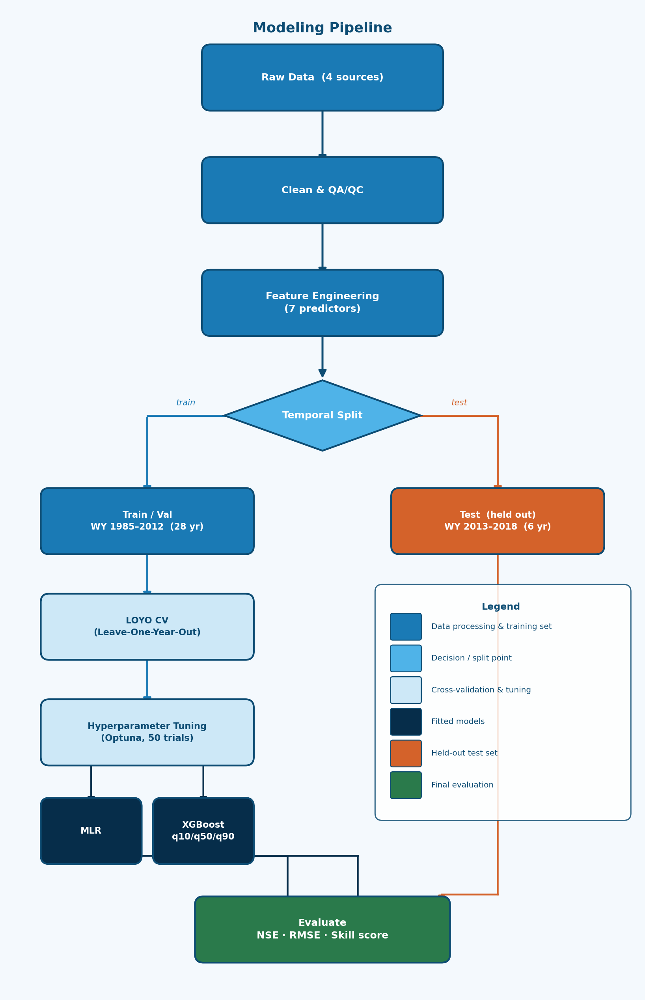

## The Problem

**Predict April–September naturalized streamflow volume at The Dalles, OR**

:::: {.columns}

::: {.column width="55%"}
- Columbia Basin snowmelt drives hydropower, agriculture, and municipal water across the PNW
- April 1 forecasts inform summer reservoir operations
- Can ML improve on existing NRCS/NWRFC statistical forecasts?
:::

::: {.column width="45%"}
| Metric | Target |
|---|---|
| NSE | > 0 (beat mean) |
| RMSE | < 8,488 kcfs-days |
| Skill score | > 0 vs climatology |
:::

::::

::: {.notes}
**Stefan** — The Dalles is the primary control point on the Columbia. Naturalized flow removes reservoir regulation so we're modeling actual basin water supply. Success bar: beat the historical average on held-out test years.
:::

---

## Data & Key Predictors

:::: {.columns}

::: {.column width="48%"}
**7 features · 34 water years (WY 1985–2018)**

| Feature | r |
|---|---|
| Apr 1 SWE anomaly (%) | **0.79** |
| Jan–Mar mean flow | 0.56 |
| Oct–Mar volume | 0.55 |
| DJF Nino3.4 | −0.46 |
| DJF PDO | −0.45 |
| DJF PNA | −0.40 |
:::

::: {.column width="52%"}

:::

::::

::: {.notes}
**Stefan** — Snowpack dominates (r = 0.79) but ENSO phase modulates the SWE–runoff relationship. La Niña enhances PNW precip; El Niño suppresses it. This scatter plot drove our feature selection.
:::

---

## Methodology

{width=95%}

Leakage prevention: hyperparameter tuning inside LOYO folds only — test set never touched during development.

::: {.notes}
**Cameron** — The temporal split is the key design decision. LOYO CV means hyperparameters were tuned without ever seeing the 6 test years — mirrors how operational April 1 forecasts work.
:::

---

## ML Results

:::: {.columns}

::: {.column width="58%"}

:::

::: {.column width="42%"}
**Test set (WY 2013–2018)**

| Model | NSE | RMSE |
|---|---|---|
| Climatology | −0.03 | 8,488 |
| **MLR** | **0.77** | **4,034** |
| XGBoost | 0.46 | 6,170 |

MLR wins — at n=34, linear relationships dominate. LOYO CV consistent: MLR 0.69, XGB 0.44.
:::

::::

::: {.notes}
**Cameron** — Simple linear model won. Apr 1 SWE is linearly correlated with spring runoff (r = 0.79), so linearity is physically correct. XGBoost would likely close the gap with a longer training record.
:::

---

## Interpretability

:::: {.columns}

::: {.column width="52%"}

:::

::: {.column width="48%"}
- **Antecedent flow** (Jan–Mar, Oct–Mar) ranked highest — integrates current-season melt signal
- **Apr 1 SWE** central — raw inches and anomaly % both matter
- **Climate indices** secondary — modulate but don't dominate
- Rankings match operational forecaster intuition
:::

::::

::: {.notes}
**Stefan** — By Jan–Mar, antecedent flow integrates more current information than the Oct–Mar volume. NRCS forecasters independently prioritize snowpack + antecedent flow — our model reproduced that hierarchy without being told to.
:::

---

## LLM Benchmarking

**Can a general-purpose LLM predict streamflow from a text description of conditions?**

:::: {.columns}

::: {.column width="55%"}
```
You are a hydrologist forecasting seasonal water supply.
Water year 2013:
  Apr 1 SWE: 25.2 in (−12% vs median)
  DJF Nino3.4: −0.43 (La Niña)
  Jan–Mar flow: 103,131 cfs ...
Return ONLY: {"prediction_kcfs_days": <number>}
```

- v1: Zero-shot · v2: 3-example few-shot
- **Parse success: 100%**
:::

::: {.column width="45%"}
| Model | Params |
|---|---|
| Phi-3.5-mini | ~3.8B |
| Phi-mini-MoE | ~7B |
| gemma-3-12b | 12B |

Same test split as ML (WY 2013–2018)
:::

::::

::: {.notes}
**Amanda** — We adapted a classification tutorial to a regression task. Strict JSON output gave 100% parse success. Tested zero-shot and few-shot, using the better-performing version per model in the benchmark.
:::

---

## ML vs LLM: Results

{width=90%}

::: {.notes}
**Amanda** — Note the flat lines for the Phi models — anchoring near climatology regardless of inputs. Gemma (12B) tracks the signal much better. Scale matters more than prompt engineering here.
:::

---

## ML vs LLM: Performance

:::: {.columns}

::: {.column width="55%"}
| Model | Type | NSE | RMSE |
|---|---|---|---|
| **MLR** | ML | **0.77** | **4,034** |
| XGBoost | ML | 0.46 | 6,170 |
| gemma-3-12b | LLM | 0.33 | 6,817 |
| Phi-3.5-mini | LLM | 0.12 | 7,824 |
| Phi-mini-MoE | LLM | −0.57 | 10,472 |
:::

::: {.column width="45%"}
- LLMs **regress to the mean** — Phi-3.5-mini returned 45,000 on 4 of 6 years
- Only Phi-mini-MoE **worse than climatology**
- Scale > prompt engineering
- Numbers are tokens, not quantities — extremes unreliable
:::

::::

::: {.notes}
**Cameron** — WY 2017 wet year: MLR predicted 57,557 ✓, Phi-mini-MoE predicted 40,000 ✗. Even gemma partially competes with tuned XGBoost — a fine-tuned domain LLM would likely do better.
:::

---

## Limitations & Risks

:::: {.columns}

::: {.column width="50%"}
**ML**

- Small training set (n=28) limits XGBoost
- Short test window (n=6) — one year swings NSE ±0.15
- PI undercoverage (~67% vs 80% target)
- Stationarity assumption — climate change may shift SWE–runoff relationships
:::

::: {.column width="50%"}
**LLM**

- Compressed variance — anchors near mean regardless of inputs
- Structural numeric reasoning limitation — not a prompt problem
- Not domain-fine-tuned

**WY 2015 — worst miss:** −51% SWE, strong El Niño. All models predicted 30–44k; observed: 31k. NRCS also missed this year.
:::

::::

::: {.notes}
**Stefan** — WY 2015 is the most important failure operationally. The LLM limitation is structural. Fine-tuning on BPA/SNOTEL data would likely close the gap significantly.
:::

---

## What We Learned

**Modeling** — Simple beats complex at small n; match model complexity to data volume

**Data** — Naturalized flow + domain-driven feature engineering were the foundation

**ML vs LLM** — Parse reliability: perfect. Prediction accuracy: not. Scale > prompt design.

**From mistakes** — CV score ≠ robustness to extremes; WY 2015 humbled every model

**As a team** — Weekly git branches + reproducible environments + domain review at every step

**Next steps:** Extend training to WY 1929 · Fine-tune LLM on domain data · Sub-basin forecasts

::: {.notes}
**All three** — go around for one bullet each. Stefan: data/modeling. Cameron: ML results. Amanda: LLM. The most valuable learning was building a reproducible, defensible pipeline and being honest about where it failed.
:::
